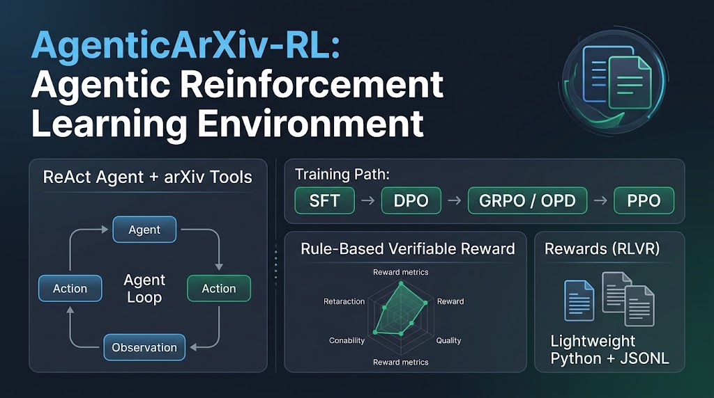

<p align="center">
  <a href="README.md">🇨🇳 中文</a> | <a href="README.en.md">🇬🇧 English</a> | <a href="README.es-ES.md">🇪🇸 Español</a>
</p>

# AgenticArXiv-RL — Entorno de Entrenamiento para RL Agentic

> **Entorno de entrenamiento de RL Agentic basado en Agente ReAct + herramientas de arXiv**  
> Soporta ruta de entrenamiento progresivo SFT/DPO/GRPO/PPO, además de una ruta opcional de OPD (destilación on-policy), para investigar aprendizaje por refuerzo en Agentes de LLM

<p align="center">
  
</p>

---

## 🎯 Posicionamiento del Proyecto

Transforma las tareas de búsqueda/descarga/traducción de papers de arXiv en un **entorno de aprendizaje por refuerzo entrenable**, enfocado en:

1. **Verifiable Reward (Recompensa Verificable)**: Basado en recompensas por reglas (precisión en llamadas a herramientas, completitud de la tarea, errores de parseo, etc.), sin necesidad de anotación humana.
2. **Entrenamiento progresivo**: SFT (Ajuste fino supervisado) → DPO (Optimización directa de preferencias) → GRPO (Optimización de política relativa por grupo) → PPO (Optimización de política proximal).
3. **Ingeniería ligera**: Puro Python + almacenamiento JSONL, sin necesidad de MySQL/FastAPI/frontend, enfocado en entrenamiento offline.

**No es objetivo**: Aplicación de arXiv de nivel producción, UI web, servicio de traducción en tiempo real (estas funcionalidades están archivadas en `archive/`).

---

## 🚀 Inicio Rápido

### Requisitos Previos

- Python 3.9+
- LLM API (que soporte formato OpenAI API, como Claude, Gemini, Qwen, etc.)
- Usar entorno virtual `.venv`

### 1️⃣ Clonar el proyecto

```bash
git clone https://github.com/Algorineko/AgenticArXiv-RL.git
cd AgenticArXiv-RL
```

Todos los comandos siguientes deben ejecutarse desde la raíz del repositorio
`AgenticArXiv-RL/`.

### 2️⃣ Configuración del Entorno

**Crear entorno virtual**:
```bash
python3 -m venv .venv
source .venv/bin/activate  # macOS/Linux
# .venv\Scripts\activate   # Windows
```

**Instalar dependencias**:
```bash
pip install -r AgenticArxiv/requirements.txt
```

**Configurar LLM API**:
```bash
cat > AgenticArxiv/.env << 'EOF'
# Configuración LLM API
LLM_BASE_URL=https://api.openai.com/v1
LLM_API_KEY=sk-your-api-key
MODEL=gpt-4-turbo

# Opcional: Configuración de rutas PDF
PDF_RAW_PATH=./output/pdf_raw
PDF_TRANSLATED_PATH=./output/pdf_translated
EOF
```

### 3️⃣ Prueba de Rollout

```bash
python -m AgenticArxiv.rl.rollout search_01 traces/train/
```

**Ejemplo de salida (la recompensa varía según la trayectoria y está en `[-1, 1]`)**:
```
✅ Rollout de Task search_01 completado
   Reward: 1.00
   Metrics: task_completed=True, tool_call_accurate=True
   Trajectory guardada en: traces/train/rollout_20260621_150000.jsonl
```

---

## 📚 Conceptos Clave

### Diseño del MDP

| Dimensión | Definición |
|------|------|
| **State** | Descripción de la tarea + historial de diálogo + resultados de herramientas |
| **Action** | 4 herramientas (búsqueda/descarga/traducción/consulta de caché de arxiv) + FINISH |
| **Reward** | Recompensa verificable multigranular de cinco componentes (format / tool / argument / process / outcome, ver más abajo) |
| **Transition** | `execute_tool(action) → observation` (`MockArxivEnv` con replay de snapshot offline, determinista y reproducible) |

### Espacio de Acciones (4 herramientas)

1. `get_recently_submitted_cs_papers(aspect, days, max_results)` — Buscar papers en arXiv
2. `download_arxiv_pdf(ref, session_id)` — Descargar PDF
3. `translate_arxiv_pdf(ref, session_id)` — Traducir PDF
4. `get_paper_cache_status(ref, session_id)` — Consultar estado de la caché
5. `search_arxiv_papers(query, max_results, days=None)` — Buscar por palabra clave, título o autor

> La búsqueda por palabras clave ya está disponible. La lectura de papers, el resumen y el análisis de figuras tienen un diseño cerrado, pero aún no están implementados; ver «🧰 Diseño de Evolución del Conjunto de Herramientas» más abajo.

### Componentes de Verifiable Reward

**Recompensa verificable multigranular de cinco componentes** (`rl/reward.py`, inspirada en la recompensa jerárquica de LLM-TIR). Cada componente se normaliza a `[-1, 1]` y se combina como suma ponderada dividida por la suma de pesos:

| Componente | Peso por defecto | Señal |
|------|:---:|------|
| `format` (formato) | 1 | Fracción de pasos cuya acción es una llamada JSON válida o un token de terminación |
| `tool` (secuencia de herramientas) | 3 | **LCS-F1** sensible al orden entre las secuencias predicha y esperada (`benchmark/metrics.py` coincidencia estricta) |
| `argument` (parámetros) | 2 | Recall de claves de parámetros × exactitud del valor; se omite automáticamente cuando la tarea no tiene `expected_tool_args` |
| `process` (proceso) | 1 | Crédito por pasos válidos menos penalizaciones por fallos de parseo/ejecución y llamadas innecesarias |
| `outcome` (resultado) | 3 | Completado correcto +1, completado con ruta de herramientas errónea +0.25, detención forzosa −0.5, error −1 |

**Aprendizaje curricular**: durante los primeros 30 pasos de entrenamiento los pesos de `tool` / `argument` / `outcome` se multiplican por 1/3 (primero el protocolo ReAct, después la semántica); desde el paso 30 todos los pesos están activos (`RewardCalculator.schedule`).

**Clave**: Todas las recompensas son **verificables** (basadas en reglas), sin necesidad de anotación humana → corresponde al marco RLVR (Reinforcement Learning with Verifiable Reward). Cada trayectoria guarda un desglose `reward_components` para auditar y detectar reward hacking.

---

## 🛠️ Ruta de Entrenamiento (SFT → DPO → GRPO / OPD)

### Fase 1: SFT (Ajuste Fino Supervisado)

**Objetivo**: Enseñar al modelo el formato básico de llamadas a herramientas.

**Pasos**:
1. Generar demostraciones de expertos:
   ```bash
   python scripts/generate_sft_data.py
   ```
2. Entrenar:
   ```bash
   python -m AgenticArxiv.rl.train_sft
   ```
3. Salida: Modelo en `./outputs/sft/final`

**Formato de datos** (`data/sft/sft_train.jsonl`):
```json
{
  "messages": [
    {"role": "system", "content": "Eres un Agente de búsqueda de papers de arXiv..."},
    {"role": "user", "content": "Busca papers de IA de los últimos 7 días"},
    {"role": "assistant", "content": "{\"name\":\"get_recently_submitted_cs_papers\",\"arguments\":{...}}"}
  ]
}
```

---

### Fase 2: DPO (Optimización Directa de Preferencias)

**Objetivo**: Que el modelo prefiera la selección correcta de herramientas y rechace rutas erróneas.

**Pasos**:
1. Realizar rollout con el modelo SFT para recolectar pares chosen/rejected:
   ```bash
   python scripts/generate_dpo_data.py
   ```
2. Entrenar:
   ```bash
   python -m AgenticArxiv.rl.train_dpo
   ```
3. Salida: Modelo en `./outputs/dpo/final`

**Formato de datos** (`data/dpo/dpo_train.jsonl`):
```json
{
  "prompt": "Busca papers de IA de los últimos 7 días",
  "chosen": "{\"name\":\"get_recently_submitted_cs_papers\",...}",
  "rejected": "{\"name\":\"download_arxiv_pdf\",...}"
}
```

---

### Fase 3: GRPO (Optimización de Política Relativa por Grupo)

**Objetivo**: Entrenamiento online usando verifiable reward, sin necesidad de value model.

**Pasos**:
```bash
python -m AgenticArxiv.rl.train_grpo
```

**Salida**: Modelo en `./outputs/grpo/final`

**Ventajas**:
- Sin necesidad de reward model (desventaja de DPO: no puede aprender online)
- Sin necesidad de value model (desventaja de PPO: alto consumo de VRAM)
- Adecuado para modelos pequeños (como Qwen2.5-1.5B)

**Rollout multiturno y puntuación de recompensa** (`rl/grpo_reward.py`): en cada turno la política actual genera una acción ReAct, un `MockArxivEnv` independiente la ejecuta y la observación se reinserta en el contexto, hasta FINISH, un fallo de parseo o `--max_turns`. Los tokens del asistente entran en la pérdida GRPO y los tokens del entorno solo hacen de contexto vía `env_mask=0`; la trayectoria completa la puntúa el `RewardCalculator` de cinco componentes, el mismo estándar que usan rollout y benchmark.

```bash
python -m AgenticArxiv.rl.build_snapshot
python -m AgenticArxiv.rl.train_grpo --model outputs/sft/final --max_turns 4

# Registrar curvas de entrenamiento (el mismo parámetro en todas las fases)
python -m AgenticArxiv.rl.train_grpo --model outputs/sft/final --report_to tensorboard
tensorboard --logdir outputs/grpo/logs
```

**Curvas de entrenamiento** (`rl/observability.py`): `--report_to` acepta `none` / `auto` / `tensorboard` / `wandb` (separados por comas), compartido por las cinco fases (SFT / DPO / GRPO / OPD / PPO). Además de las métricas que ya trae TRL, se registran:

| Grupo de métricas | Contenido | Por qué se registra aparte |
|---|---|---|
| `reward_components/*` | format / tool / argument / process / outcome | cada uno acotado a `[-1,1]` e independiente de los pesos |
| `reward_weights/*` | pesos actuales del currículo | el currículo reduce tool/argument/outcome los primeros 30 pasos, así que mirar solo la recompensa total confunde «se abrieron los pesos» con «la política retrocedió» |
| `rollout/*` | turns / finished / parse_error_rate / tool_error_rate | cuando la recompensa cae, separa «la política retrocedió» de «nunca aprendió a terminar y agota max_turns» |

### Garantías de calidad del entrenamiento (verificación automática)

El pipeline de entrenamiento incorpora varias capas de validación automática que convierten los "fallos de entrenamiento silenciosos" en errores sonoros:

- **Chequeo de longitud de generación**: antes de entrenar comprueba que `max_completion_length` pueda contener la acción canónica, evitando vueltas con gradientes nulos en las que el modelo nunca emite una acción completa
- **Guardia de varianza nula**: interrumpe el entrenamiento (con sugerencias de solución) cuando la varianza de recompensa dentro del grupo se mantiene en 0, es decir, todas las ventajas son cero (`RewardVarianceGuard`)
- **Evaluación canary**: muestrea sobre tareas fijas cada N pasos y detiene antes de tiempo si el desempeño degrada bajo el umbral repetidamente (`CanaryCallback`)
- **Verificación por etapa**: el modelo saliente de cada fase debe superar un umbral mínimo de calidad — tasa de parseo SFT ≥ 0.3, reward promedio DPO ≥ −0.3, reward promedio GRPO ≥ −0.2 (`StageVerifier`, se omite con `--no-verify`)
- **Precisión mixta adaptativa**: bf16 primero en CUDA, con respaldo a fp16, desactivada en CPU / MPS (`rl/precision.py`)
- **Validación del backend de registro**: un backend indicado en `--report_to` que no esté instalado falla antes de cargar el modelo, para no terminar un entrenamiento y descubrir que no hay ninguna curva (`rl/observability.py`)

### Fase 3': OPD (On-Policy Distillation, opcional, intercambiable con GRPO)

**Objetivo**: destilar la capacidad de acción ReAct del estudiante a partir de la señal por token de un profesor fuerte, sin depender de ninguna recompensa durante el entrenamiento.

**Pasos**:
```bash
python -m AgenticArxiv.rl.train_opd --model outputs/sft/final --teacher Qwen/Qwen2.5-7B-Instruct

# OPD agéntico multi-turno: ejecutar Action → Observation → Action
python -m AgenticArxiv.rl.train_opd --model outputs/sft/final \
  --teacher Qwen/Qwen2.5-7B-Instruct --max_turns 4 \
  --snapshot data/mock_arxiv_snapshot.json
```

**Salida**: modelo `./outputs/opd/final`

**Posicionamiento**: OPD es un **paradigma de entrenamiento completo**, no un simple truco — el estudiante muestrea on-policy sobre los prompts de las tareas, el profesor puntúa cada token con sus logprobs, y la pérdida es la KL reversa `D_KL(π_estudiante ‖ π_profesor)` (mode-seeking). Frente a GRPO es la "ruta del profesor" frente a la "ruta de la recompensa":

| Dimensión | GRPO | OPD |
|---|---|---|
| Señal de aprendizaje | verifiable reward de cinco componentes (dispersa, a nivel de trayectoria) | logprobs por token del profesor (densa) |
| Modelo extra | ninguno | modelo profesor (necesita pesos locales para los logprobs; las APIs externas no exponen distribuciones por token) |
| Techo de rendimiento | puede explorar más allá del profesor | converge al comportamiento del profesor |
| Mejor cuando | hay recompensa verificable y no hay profesor | hay un profesor fuerte y se quiere ahorrar el costo de exploración de RL |

OPD también puede usarse como truco: warm start antes de RL, regularización teacher-KL dentro de RL, o el PG-OPD de verl (la KL reversa tratada como recompensa para el gradiente de política).

**Modos single-turn y multi-turn**: `--max_turns 1` (predeterminado) conserva el comportamiento original prompt/completion de GKDTrainer. `--max_turns > 1` activa OPD agéntico: cada trayectoria recibe un `MockArxivEnv` independiente, se ejecutan las herramientas y la Observation real se inserta en el turno siguiente. Las etiquetas del prompt y de Observation son `-100`; reverse-KL se calcula solo sobre tokens assistant generados por el estudiante. La primera versión exige vocabularios token-to-id idénticos y falla antes de entrenar si difieren. Estudiante y profesor comparten GPU (1.5B + 7B necesitan unos 17GB solo para pesos bf16; gradientes, optimizador y logits requieren memoria adicional, por lo que se recomienda un modelo menor en una GPU de 32GB). Verificado con trl 1.5.1 (`trl.experimental.gkd`); `beta=1.0` selecciona reverse-KL. Canary y la verificación por etapa siguen compartiéndose con GRPO.

**Comparación offline**: ejecuta SFT, `--max_turns 1`, `--max_turns > 1` y GRPO con el mismo snapshot y task set, y compara los resultados comunes de `StageVerifier` en `final/verification_report.json` de cada directorio de salida. Esas recompensas solo se usan para evaluación y nunca entran en la pérdida OPD.

---

## 📂 Estructura de Directorios

```
AgenticArXiv-RL/
├─ AgenticArxiv/                     # ⭐ Paquete Python (entorno de entrenamiento RL)
│  ├─ agents/                        # Núcleo del Agente
│  │  ├─ base_agent.py              # Bucle ReAct genérico
│  │  ├─ agent_engine.py            # ReActAgent (política RL)
│  │  ├─ context_manager.py
│  │  ├─ prompt_templates.py
│  │  └─ side_effects.py           # Interfaz desacoplada para efectos secundarios
│  ├─ tools/                         # Capa de herramientas (espacio de acciones)
│  │  ├─ tool_registry.py          # Registro de herramientas
│  │  ├─ arxiv_tool.py             # Búsqueda en arXiv
│  │  ├─ pdf_download_tool.py      # Descarga de PDF
│  │  ├─ pdf_translate_tool.py     # Traducción de PDF
│  │  └─ cache_status_tool.py      # Consulta de caché
│  ├─ benchmark/                     # ⭐ Fuente de Verifiable Reward
│  │  ├─ metrics.py               # TaskMetrics, coincidencia estricta de herramientas y parámetros
│  │  ├─ tasks.py                 # BENCHMARK_TASKS (8 tareas de humo)
│  │  ├─ tasks_expanded.py        # Conjunto de tareas ampliado (59 tareas, 8 familias de plantillas)
│  │  ├─ task_spec.py             # TaskSpec: expected_tools / expected_tool_args derivados de steps
│  │  ├─ badcases.py              # Veredictos y replay de casos malos
│  │  ├─ splits.py                # Partición train/iid/ood a nivel de plantilla
│  │  ├─ baselines.py · run_baselines.py  # Baselines deterministas de política degradada (puertas por categoría)
│  │  ├─ runner.py · run_benchmark.py     # Ejecutor de benchmarks y entrada CLI
│  │  └─ report.py                # Informe de métricas
│  ├─ rl/                            # ⭐ Núcleo RL
│  │  ├─ train_sft.py              # ⭐ Entrenamiento SFT
│  │  ├─ train_dpo.py              # ⭐ Entrenamiento DPO
│  │  ├─ train_grpo.py             # ⭐ Entrenamiento GRPO (con guardias de entrenamiento)
│  │  ├─ train_ppo.py              # ⭐ Entrenamiento PPO (Actor-Critic)
│  │  ├─ train_opd.py              # ⭐ Entrenamiento OPD (destilación on-policy, intercambiable con GRPO)
│  │  ├─ opd_multiturn.py          # Rollout multi-turno, máscaras Observation y pérdida GKD propia
│  │  ├─ env.py                    # RLEnv + MockArxivEnv (entorno de snapshot offline)
│  │  ├─ multiturn_env.py          # Adaptador multiturno para TRL (environment_factory, una instancia por generación)
│  │  ├─ reward.py                 # RewardCalculator (recompensa de 5 componentes + currículum)
│  │  ├─ grpo_reward.py            # Adaptador de recompensa GRPO (completion de un paso → trayectoria)
│  │  ├─ rollout.py                # Recopilación de datos de rollout offline
│  │  ├─ trajectory.py             # Trajectory + lectura/escritura JSONL
│  │  ├─ build_snapshot.py         # Genera snapshot offline de arXiv (único paso con red)
│  │  ├─ canary.py                 # Evaluación periódica en entrenamiento (detención temprana)
│  │  ├─ stage_verifier.py         # Verificación de umbral de calidad por fase
│  │  ├─ precision.py              # Estrategia de precisión mixta (bf16/fp16/CPU)
│  │  └─ observability.py          # Backends de registro + curvas por componente
│  ├─ models/                        # Capa de almacenamiento (store_memory para RL, store_mysql para Web)
│  ├─ services/                      # Servicios de efectos secundarios (event_bus / log / runtime)
│  ├─ api/ · mcp_protocol/ · skill_cli/   # Capas de compatibilidad Web / MCP / Skill archivadas
│  ├─ utils/                         # llm_client, logger, utilidades PDF
│  ├─ tests/                         # 30 tests unitarios (unittest)
│  └─ requirements.txt
├─ scripts/                          # Generación de datos
│  ├─ generate_sft_data.py          # Trayectorias expertas con LLM API
│  └─ generate_dpo_data.py          # Pares de preferencia muestreando el modelo SFT local
├─ docs/
│  ├─ rl_building.md               # Plan de refactorización completo
│  ├─ multigranular_rl.md         # Diseño de recompensa multigranular (5 componentes + currículum)
│  └─ metric_stats.md            # Plan de estadísticas/métricas
├─ data/                             # Datasets (sft/ y dpo/ están en .gitignore — generarlos primero)
│  ├─ sft/                           # Dataset SFT (JSONL)
│  ├─ dpo/                           # Pares DPO (JSONL)
│  └─ mock_arxiv_snapshot.json       # Snapshot del MockEnv
├─ eval/                             # Bucle de replay de casos malos
│  ├─ badcase_replay.py             # CLI de replay / captura (sin LLM)
│  ├─ eval_cases.jsonl              # Biblioteca de casos, doble uso como biblioteca de reward hacking
│  └─ readme.md
├─ traces/                           # Almacenamiento de Trajectory (JSONL, gitignored)
├─ archive/                          # Archivado (app web original: PDFMathTranslate / arxiv-api / weather-agent)
├─ AgenticArxivWeb/                  # Frontend Vue3 original (archivado)
├─ bin/ · Makefile · Overview.md     # Scripts de arranque Web heredados y docs (a modernizar)
└─ README.md / README.en.md / README.es-ES.md   # 🇨🇳 🇬🇧 🇪🇸
```

---

## 🔬 Ejemplos de Uso

### 1. Rollout (recopilar trajectory)

```bash
# Tarea individual
python -m AgenticArxiv.rl.rollout search_01 traces/train/

# Rollout por lotes
python -m AgenticArxiv.rl.rollout --all --output_dir traces/train/
```

### 2. Flujo de Entrenamiento (SFT → DPO → GRPO)

```bash
# Paso 1: Generar datos SFT
python scripts/generate_sft_data.py

# Paso 2: Entrenamiento SFT
python -m AgenticArxiv.rl.train_sft

# Paso 3: Generar datos DPO (requiere modelo SFT)
python scripts/generate_dpo_data.py

# Paso 4: Entrenamiento DPO
python -m AgenticArxiv.rl.train_dpo

# Paso 5: Entrenamiento GRPO
python -m AgenticArxiv.rl.train_grpo
```

### 3. Prueba de cálculo de Reward

```python
from rl.reward import RewardCalculator
from benchmark.tasks import get_task_by_id

task_def = get_task_by_id('search_01')
# Construir un resultado mock
result = {
    'history': [
        {'thought': '...', 'action': '...', 'observation': '...'},
        {'thought': '...', 'action': 'FINISH', 'observation': '...'},
    ],
    'timing': {...},
    'token_usage': {...},
    'iteration_count': 2,
}

reward_calc = RewardCalculator()
reward, metrics = reward_calc.compute_reward(task_def, result)
print(f'Reward: {reward:.2f}')  # Rango de recompensa: [-1, 1]; el valor depende de la trayectoria
```

---

## 🧪 Conjunto de Tareas y Evaluación

### Conjunto de humo (`benchmark/tasks.py`, 8 tareas)

| ID | Tarea | Tipo | Herramienta Esperada |
|----|------|------|---------|
| `search_01` | Buscar papers de IA de los últimos 7 días | Búsqueda | `get_recently_submitted_cs_papers` |
| `search_02` | Obtener papers de ML de los últimos 3 días | Búsqueda | `get_recently_submitted_cs_papers` |
| `search_03` | Buscar papers de NLP de los últimos 7 días | Búsqueda | `get_recently_submitted_cs_papers` |
| `search_04` | Buscar papers de todas las categorías de ciencias de la computación de los últimos 7 días | Búsqueda | `get_recently_submitted_cs_papers` |
| `download_01` | Descargar PDF del 1er paper | Descarga | `download_arxiv_pdf` |
| `translate_01` | Traducir el 1er paper | Traducción | `translate_arxiv_pdf` |
| `cache_01` | Ver estado de caché del 1er paper | Caché | `get_paper_cache_status` |
| `composite_01` | Búsqueda + Descarga | Compuesta | `get_recently_submitted_cs_papers`, `download_arxiv_pdf` |

### Conjunto ampliado (`benchmark/tasks_expanded.py`, 59 tareas)

Se activa con `run_benchmark.py --task-set expanded` y cubre ocho familias de plantillas: search / ref_form / composite / state / optional / constraint / long_chain / infeasible. Ambos conjuntos pasan por el `TaskSpec` de `benchmark/task_spec.py`: `expected_tools` y `expected_tool_args` se derivan de la misma fuente `steps`, así que dos listas mantenidas a mano nunca pueden divergir.

### Métricas de evaluación y particiones

Más allá de «tasa de éxito + tokens/iteraciones medias», el informe incluye:

- **Fiabilidad `pass^k`** (convención tau-bench, estimada por tarea y luego promediada; las tareas con pocas muestras se marcan como omitidas, no como 0)
- **`false_finish`**: termina con FINISH pero no se llamaron todas las herramientas esperadas — políticas degradadas miden `always_finish` 91.5% vs `reference` 0%
- **`ref_score`**: compara el `paper_id` resuelto en vez del literal `ref`, eliminando a la vez falsos positivos y falsos negativos
- **Costo normalizado por aciertos** (`skill_cli` corregido de 43% a 99% más caro) y desglose de modos de fallo

Las tareas se particionan por **plantilla** en train/iid_test/ood_test (`benchmark/splits.py`, fijado en `data/splits/v1.json`); `--split` está conectado tanto en `run_benchmark.py` como en `train_grpo.py`; `rl_train` toma solo la banda intermedia de tasa de éxito — las tareas de los extremos tienen varianza cero dentro del grupo y no producen gradiente.

### Puertas de discriminación y replay de casos malos

- **Puerta de discriminación por categoría** (`benchmark/run_baselines.py`): cuantifica la discriminación de la recompensa con políticas degradadas deterministas y fija umbrales por categoría (`tests/test_reward_discrimination.py`) — tras corregir las cuatro fugas de puntuación en la partida de argumentos, «buscar siempre cs.AI sin mirar la tarea» bajó de 0.833 a 0.446 en las tareas de búsqueda, y «llamar a una herramienta cuando lo correcto es no hacer nada» pasó de +0.165 a −0.235.
- **Replay de casos malos** (`eval/badcase_replay.py` + `eval/eval_cases.jsonl`): congela una trayectoria fallida junto con el veredicto original en un caso de regresión permanente; el replay solo re-ejecuta el evaluador, sin LLM / red / herramientas, así que `pytest` es en sí mismo la puerta (`tests/test_badcases.py::ShippedCasesTest`). Los casos son `open` (el fallo sigue ahí) o `fixed` (ya corregido — reproducirlo de nuevo es una regresión, código de salida 1); `hack/*` registra trayectorias tramposas de políticas degradadas con aserciones de umbral («este comportamiento no debe sacar X», custodiando los dos agujeros corregidos en #40 y #47), con doble uso como biblioteca de reward hacking — complementaria a las puertas de `run_baselines.py`: **las puertas miran medias, los casos clavan fallos individuales**. `--save-traces` + `capture` eligen casos malos de trayectorias reales por `false_finish` / `ref_score` / secuencia de herramientas, no solo los que cascan.

---

## 📊 Monitoreo de Métricas

### Curva de Reward

Monitorear con TensorBoard o wandb:
```bash
tensorboard --logdir ./outputs/grpo/logs
```

### Métricas Clave

| Métrica | Descripción | Objetivo |
|------|------|------|
| `reward` | Recompensa promedio | ↑ Incremento |
| `kl_div` | Divergencia KL (vs modelo de referencia) | ↔ Estable (no excesiva) |
| `task_completed_rate` | Tasa de éxito de la tarea | ↑ Incremento |
| `tool_call_accurate_rate` | Tasa de precisión en llamadas a herramientas | ↑ Incremento |
| `parse_failures` | Número de fallos de parseo | ↓ Disminución |
| `tool_exec_failures` | Número de fallos en ejecución de herramientas | ↓ Disminución |

---

## 🛡️ Notas sobre Dependencias

**Dependencias principales** (`requirements.txt`, cubre rollout / benchmark / las cinco fases de entrenamiento):
```txt
torch>=2.0.0
transformers>=4.45.0
trl>=0.28.0               # el mínimo lo fija el GRPO multiturno: solo desde 0.28.0 se llama
                          # a rollout_func en la ruta sin vLLM — versiones anteriores degradan
                          # en silencio los rollouts multiturno; verificado en 0.29.1 (OPD en 1.5.1)
datasets>=2.14.0
accelerate>=0.25.0
arxiv
requests
python-dotenv
loguru
pydantic>=2.0
fire
```

**Dependencias opcionales** (`requirements-extra.txt`, instalar según necesidad; el pipeline de entrenamiento principal no las requiere):
- `pdf2zh` — traducción real de PDF (el entrenamiento/benchmark usan el mock; solo para eval/demos de traducción)
- `fastapi` / `uvicorn` / `sqlalchemy` / `pymysql` — solo para ejecutar la versión Web archivada
- `tensorboard` (recomendado, cero configuración y offline) / `wandb` — backends de curvas de entrenamiento para `--report_to`

---

## 🔗 Recursos Relacionados

### Documentación Oficial
- [Documentación de TRL](https://huggingface.co/docs/trl/)
- [SFTTrainer](https://huggingface.co/docs/trl/en/sft_trainer)
- [DPOTrainer](https://huggingface.co/docs/trl/en/dpo_trainer)
- [GRPOTrainer](https://huggingface.co/docs/trl/en/grpo_trainer)

### Papers
- **InstructGPT** (OpenAI, 2022): Tres fases de RLHF (SFT → RM → PPO)
- **DPO** (Stanford, 2023): Optimización directa de preferencias
- **RLVR**: Reinforcement Learning with Verifiable Reward
- **On-Policy Distillation** ([Thinking Machines Lab, 2025](https://thinkingmachines.ai/blog/on-policy-distillation/)): origen de la receta OPD (muestreo on-policy del estudiante + KL reversa por token del profesor)
- **GKD / On-Policy Distillation of Language Models** (Agarwal et al., ICLR 2024, [arXiv:2306.13649](https://arxiv.org/abs/2306.13649)): destilación JSD generalizada, base del GKDTrainer de TRL
- **Rethinking On-Policy Distillation of Large Language Models** ([arXiv:2604.13016](https://arxiv.org/abs/2604.13016)): replicación y análisis independientes de la receta OPD

### AgenticArXiv Original (versión Web App)
Este proyecto se basa en [AgenticArXiv](https://github.com/Algorineko/AgenticArXiv), la versión original incluye:
- Backend FastAPI + frontend Vue3
- Tres arquitecturas de Agente (ReAct/MCP/Skill)
- Push SSE en tiempo real, almacenamiento MySQL, servicio de traducción de PDF

Estas funcionalidades están archivadas en `archive/`.

---

## 🤝 Contribuir

¡Son bienvenidos los Issues y Pull Requests!

### Recomendaciones de Desarrollo
1. Haz fork de este repositorio
2. Crea una rama feature: `git checkout -b feature/your-feature`
3. Commitea los cambios: `git commit -m "feat: add your feature"`
4. Empuja la rama: `git push origin feature/your-feature`
5. Envía el Pull Request

---

## 📄 Licencia

Licencia MIT

---

## 🙋 FAQ

### Q: ¿Diferencias con el AgenticArXiv original?

| Dimensión | AgenticArXiv Original | Este Proyecto (AgenticArXiv-RL) |
|------|------------------|-------------------------|
| **Enfoque** | Aplicación arXiv de nivel producción | Entorno de investigación para entrenamiento RL |
| **Arquitectura** | FastAPI + Vue3 + MySQL | Puro Python + JSONL |
| **Modo Agente** | 3 tipos (ReAct/MCP/Skill) | Solo ReAct (simplificado) |
| **Funcionalidades clave** | Traducción en tiempo real, SSE, UI web | Entrenamiento SFT/DPO/GRPO |
| **Dependencias** | Pesadas (14+ paquetes) | Livianas (11 paquetes principales + extras opcionales) |

### Q: ¿Por qué se mantiene solo ReAct y se archiva MCP/Skill?

El entrenamiento RL se enfoca en una política única (parseo regex de ReAct). MCP/Skill añaden complejidad sin cambiar la lógica central.

### Q: ¿Por qué cambiar a JSONL en lugar de MySQL?

- **Portabilidad**: JSONL no requiere dependencias de base de datos
- **Ligero**: Más adecuado para escenarios offline de entrenamiento RL
- **Compatibilidad TRL**: Los datasets de TRL soportan JSONL directamente

### Q: ¿Por qué elegir GRPO y no PPO?

GRPO es más adecuado para proyectos de aprendizaje ligeros:
- ✅ Sin necesidad de value model adicional (menor consumo de VRAM/costo de entrenamiento)
- ✅ Adecuado para modelos pequeños (como Qwen2.5-1.5B)
- ✅ Implementación simple, fácil de depurar

PPO es más adecuado para entrenamiento de modelos grandes de nivel producción (7B+), este proyecto como demo de aprendizaje no lo cubre.

### Q: ¿Cómo elegir entre OPD, SFT, DPO y GRPO?

| Escenario | Recomendación |
|------|------|
| Hay demostraciones de experto, aprender primero el formato de acción | SFT |
| Hay pares de preferencia (trayectorias buenas/malas), sin recompensa en línea | DPO |
| Hay recompensa verificable y se quiere superar la línea base en línea | GRPO |
| Hay un modelo profesor fuerte y se quiere ahorrar el costo de exploración de RL | OPD |

Se complementan entre sí: SFT es el punto de partida de todas las rutas; OPD y GRPO van encima de SFT — la primera destila desde un profesor (techo = profesor), el segundo optimiza contra recompensa verificable (puede explorar más allá), y la salida de cualquiera puede servir de inicialización o de línea base para el otro.

---

## 🧰 Diseño de Evolución del Conjunto de Herramientas (borrador de diseño, sin implementar)

> El objetivo final de este proyecto es un **LLM ligero desplegado localmente que resuelva de forma autónoma la búsqueda, descarga e interpretación de papers de arXiv**. Esta sección es solo diseño; nada está implementado aún.

### Estado actual y brechas

| Herramienta | Capacidad | Límite |
|------|------|------|
| `get_recently_submitted_cs_papers` | Búsqueda por categoría + ventana temporal | Solo entiende `cat:cs.*` + fecha de envío — **sin búsqueda por palabras clave / título / autor**, sin paginación; resúmenes truncados a 200 caracteres |
| `download_arxiv_pdf` | Descargar PDF | — |
| `translate_arxiv_pdf` | Traducción del paper completo con pdf2zh | Produce un archivo PDF traducido — **el contenido del paper nunca entra en el contexto del modelo**; depende del extra opcional |
| `get_paper_cache_status` | Consulta de caché | — |

Dos conclusiones:

1. **La mitad de «búsqueda» del bucle está incompleta**: las tareas de navegación («qué hay de nuevo en cs.AI») funcionan, pero las tareas de búsqueda puntual («busca el paper xxx», «quién propuso xxx») son imposibles en el espacio de acciones actual.
2. **La mitad de «interpretación» del bucle falta por completo**: lo único que el modelo llega a «ver» de un paper es un recorte de 200 caracteres del resumen en los resultados de búsqueda. Sin una herramienta de lectura, resumir / preguntar / analizar figuras no tienen recorrido — traducir produce un archivo, y eso no es interpretar.

Además, **un espacio de acciones más grande no es automáticamente mejor**: la política es un modelo de ~1.5B, y cada herramienta nueva amplía la carga de aprendizaje de selección de herramientas y formato JSON. El criterio de admisión de una herramienta nueva es «habilita una nueva categoría de tareas», no «puede que sea útil» — de los 5 candidatos de la tabla, T1/T2 son el camino crítico, T3 es el incremento principal, T4/T5 son opcionales.

### Herramientas nuevas propuestas (en orden de dependencia)

| Prioridad | Herramienta | Diseño | Por qué sigue siendo amiga de RLVR |
|--------|------|----------|----------------------|
| **T1** ✅ | `search_arxiv_papers(query, max_results, days=None)` | Búsqueda por palabras clave mapeada a los campos `all:` / `ti:` / `au:` de la API de arXiv; coexiste con la herramienta actual (navegar por ventana temporal y búsqueda puntual son tipos de tarea distintos) | Las herramientas/parámetros esperados siguen derivándose de `task_spec.steps`; `MockArxivEnv` repite offline indexado por un hash del query, y los query no recogidos degradan de forma **determinista** (devuelve un subconjunto fijo, marcado explícitamente en la observation) — reproducible, y evita que el modelo confunda un resultado vacío con una búsqueda exitosa |
| **T2** | `get_paper_content(ref, section=None)` | PDF → texto plano (PyMuPDF); por defecto devuelve title/abstract, y por secciones (method / result / conclusion) a petición | Extracción de texto determinista, sin LLM; los resultados de extracción van pre-guardados en el snapshot. **Es el prerrequisito de todas las tareas de interpretación** |
| **T3** | `summarize_paper(ref, style, max_words)` | Resumir un paper: un modelo resumidor local **en el lado del entorno** (con el texto de T2 como entrada) devuelve el resumen | Lo entrenable es «cuándo llamarlo, sobre qué ref, si style/longitud son correctos» — todo verificable por reglas; la calidad del resumen en sí **no entra en la recompensa** (ver abajo) |
| **T4** (opcional) | `extract_paper_figures(ref)` | Preparación de figuras/tablas: extrae imágenes de figuras + captions, devuelve rutas de archivos | Determinista; se verifica «ref correcto + archivos existen + cantidad ≥ 1» |
| **T5** (opcional, multimodal) | `analyze_figure(ref, figure_no, question=None)` | Análisis de figuras: un VLM local del lado del entorno (p. ej. Qwen2.5-VL) lee la figura y responde | Las reglas solo juzgan «si se llamó bien y si los parámetros son correctos»; la calidad de la respuesta del VLM no entra en la recompensa, manteniendo el ruido de un modelo tercero fuera del gradiente de política |

Plantillas de tareas asociadas (siguiendo las ocho familias de `tasks_expanded.py`, todas derivadas declarativamente de `task_spec.steps`):

- `search_kw_*`: tareas de búsqueda por palabras clave (T1)
- `read_*` / `qa_*`: buscar → descargar → leer contenido (T1/T2)
- `summary_*`: buscar → descargar → leer → resumir (T3), nuevo material `long_chain`
- `figure_*` (opcional): buscar → descargar → extraer figuras → análisis de figuras (T4/T5), activo solo en entornos multimodales

### Diseño derivado para entrenamiento y evaluación

1. **Extensión del snapshot**: `build_snapshot.py` lo hace todo de una pasada — además de los resultados de búsqueda, **pre-extrae el texto completo y los archivos de figuras** de los papers del snapshot; todas las herramientas nuevas se repiten offline, conservando el contrato de «build_snapshot es el único paso con red».
2. **Cero cambios en la recompensa**: el esquema de cinco componentes se reutiliza tal cual; `expected_tools` / `expected_tool_args` se derivan de `steps`, así que `reward.py` y el currículo no se tocan.
3. **Prevención de reward hacking**: las herramientas de interpretación abren una superficie nueva para «llamar herramientas al azar para farmear puntos de process» — reutilizar las puertas por categoría de `run_baselines.py` + clavar casos individuales en `eval/eval_cases.jsonl` (p. ej. llamar a `summarize_paper` con un ref que apunta a un paper inexistente debe restar puntos).
4. **El problema de la recompensa por calidad del resumen (deliberadamente no hecho)**: convertir «si el resumen es bueno» en recompensa requiere LLM-as-judge o rúbricas, lo que introduce recompensas no deterministas y una nueva superficie de hacking. El diseño reduce primero el resumen a un **problema de decisión de llamada a herramientas** (cuándo llamar, a quién); evaluar calidad queda como un proyecto aparte a largo plazo.
5. **La frontera multimodal (aislada deliberadamente)**: el VLM de T5 vive solo en el lado del entorno; la política sigue siendo un modelo pequeño de solo texto — en el espacio de acciones solo está «llamar o no, cómo preguntar», y la comprensión de figuras se externaliza al entorno. Solo si la política en sí se vuelve multimodal se consideraría meter imágenes en la observation.
6. **Requisito de hardware**: T3/T5 añaden cada uno un modelo del lado del entorno (~2GB el resumidor, ~6GB el VLM, menos cuantizados); no afectan a la VRAM de entrenamiento (sin gradientes). Si el hardware no llega, hacer solo T1/T2/T4 — el camino crítico real del bucle de interpretación es T2.

### Orden de implantación

```
T1 búsqueda por palabras clave ──→ T2 leer contenido ──→ T3 resumir   (bucle de interpretación)
                                        └────→ T4 extraer → T5 analizar figuras (opcional, entorno multimodal)
```

Cada vez que aterriza una herramienta: ampliar las plantillas de tareas → re-ejecutar `run_baselines.py` para recalcular los umbrales de discriminación por categoría → regenerar los datos SFT/DPO → añadir los casos correspondientes a `eval/eval_cases.jsonl`.

---

## 📝 TODO (Hoja de Ruta de Desarrollo)

Ordenado por prioridad. ¡Las contribuciones son bienvenidas (ver 🤝 Contribuir)!

### P0 — Expansión del conjunto de herramientas (bucle de interpretación)

T1 está implementado; el resto tiene diseño cerrado (ver «🧰 Diseño de Evolución del Conjunto de Herramientas»):

- [x] **T1 Búsqueda por palabras clave** `search_arxiv_papers`: añade la búsqueda puntual de «encontrar un paper concreto»
- [ ] **T2 Lectura de papers** `get_paper_content`: PDF → texto, el prerrequisito de todas las tareas de interpretación (camino crítico)
- [ ] **T3 Resumen de papers** `summarize_paper`: resumen del lado del entorno, convirtiendo «interpretar» en una decisión de llamada a herramientas entrenable
- [ ] **T4/T5 Extracción y análisis de figuras** (opcional, entorno multimodal): después de T1–T3; el VLM vive solo en el lado del entorno

### P1 — Ajuste del currículo de recompensa

- [ ] **Calibración del currículo multigranular**: la rebaja de pesos de los primeros 30 pasos es un valor a priori; calibrarlo necesita datos de entrenamientos reales. La puerta de casos de reward hacking ya está en su sitio (ver la parte de replay de casos malos en «Conjunto de Tareas y Evaluación»).

### P2 — Rendimiento y escala

- [ ] **Muestreo acelerado con vLLM**: sustituir HF generate para aumentar el throughput de muestreo del rollout multiturno.
- [ ] **Soporte multi-GPU**: configuración accelerate / FSDP (accelerate ya es dependencia, pero hoy sin configurar, un proceso en una sola GPU).

### P3 — Largo plazo (evolución algorítmica)

- [ ] **Mejoras estilo DAPO**: clip-higher, dynamic sampling, filtro de overlong, loss a nivel de token (loss/clip viven dentro de TRL; requieren un fork o sobrescribir `compute_loss`).
- [ ] **Framework de entrenamiento asíncrono**: migrar a verl `fully_async_policy` / AReaL para alojar SAO (abajo).

### 🔭 SAO: el algoritmo RL agéntico asíncrono de próxima generación

> **SAO (Single-Rollout Asynchronous Optimization; Optimización Asíncrona de Rollout Único)** fue propuesto por el KEG Lab de la Universidad de Tsinghua (2026-07) como evolución de GRPO para el entrenamiento **agéntico asíncrono**. Motivación: el rollout es el cuello de botella en tareas agénticas de largo horizonte, y el muestreo por grupos de GRPO se vuelve off-policy e inestable bajo asincronía (normalmente colapsa en menos de 200 pasos).
>
> Componentes técnicos clave:
> 1. **Muestreo de rollout único**: una trayectoria por prompt, consumida en cuanto llega, en lugar de comparación por grupos;
> 2. **DIS (Direct Bilateral Importance Sampling)**: calcula `r_t = π_θ / π_rollout` a partir de los log-probs por token registrados durante el rollout y **enmascara los tokens fuera del intervalo de confianza `[1−ε_l, 1+ε_h]`** (no como el recorte unilateral de PPO);
> 3. **Actualizaciones desacopladas del value model**: el value model se actualiza dos veces por cada actualización de política (1:2), con las **capas de atención congeladas** durante su entrenamiento (solo se entrenan las proyecciones MoE);
> 4. **GAE con omisión de observaciones**: las ventajas se propagan solo entre los tokens generados por el modelo, omitiendo los tokens de observación del entorno para filtrar ruido.
>
> Resultados: entrenamiento estable durante ~1000 pasos; **97.3%** en AIME2025 (vs 84.2% en GRPO), 29.8% en SWE-Bench Verified; ya usado para entrenar GLM-5.2 (750B).
>
> Ruta de adopción: el rollout multiturno ya está disponible → introducir la omisión de observaciones y el recorte bilateral DIS → migrar a verl `fully_async_policy` (`gen_batch_size=1` / `staleness_threshold` / TIS a nivel de token, alineado con SAO) o AReaL v1.0 para entrenamiento totalmente asíncrono + value model.
>
> 📄 **Paper**: [Single-Rollout Asynchronous Optimization for Agentic Reinforcement Learning (arXiv:2607.07508)](https://arxiv.org/abs/2607.07508) (Tsinghua KEG; código oficial aún no liberado)

---

**¡Comienza tu viaje de entrenamiento en RL Agentic!** 🚀
